# 操作系统实验报告

## 实验基本信息

| 项目 | 内容 |
|------|------|
| **实验名称** | Lab1：最小可执行内核与启动流程 |
| **小组成员** | 2412396-申丰铭（组长）、2411688-马翔宇、2413992-任诗清 |
| **本地复核日期** | 2026-10-05（按答疑修正为 QEMU 4.1.1；新截图待补） |

### 小组分工

| 成员 | 负责的练习/模块 |
|------|----------------|
| 2412396-申丰铭（组长） | 统筹实验；配置交叉编译与仿真环境；完成练习2；核对课程版本与启动参数；整理调试与验证工具；管理实验分支和提交 |
| 2411688-马翔宇 | 负责练习1；分析入口汇编、链接脚本、内核栈与调用约定；整理 OS 原理对应关系 |
| 2413992-任诗清 | 整理测试日志和截图；协助复核练习2；检查报告格式与图片引用 |

报告分工：申丰铭负责整体逻辑、环境、调试过程及主稿整合；马翔宇负责入口汇编解释和知识点总结；任诗清负责证据整理和全文校对。上述为组长授权安排的分工；另两位成员的实际运行与报告复核尚未收到确认，不能据此声称全员已完成。

---

## 一、实验目的

1. 理解 RISC-V 从复位、执行固件到进入最小内核的过程，区分 QEMU、MROM、OpenSBI 与内核的职责。
2. 理解链接脚本如何确定内存布局与入口地址，掌握 C/汇编源文件经交叉编译生成 ELF 和裸镜像的流程。
3. 解释入口代码建立栈并移交 C 初始化函数的原因，理解 SBI 控制台输出调用链。
4. 用 QEMU/GDB 观察真实的 PC、SP、RA 变化，以调试证据验证源码分析和 AI 解释。

Lab1 两项练习分别要求源码分析与启动调试，没有要求实现新的内存管理、调度或中断功能。本次保留内核框架，补充运行兼容性、调试脚本、测试证据和报告。

---

## 二、实验环境

2026-10-05 依据课程答疑第18条及组长补齐的完整问题，将课程环境修正为 QEMU 4.1.1。已独立重新编译 RV64 裸机内核，使用原框架的 loader 启动参数运行，并完成13项额外本地检查。当前主要实验目录为 Ubuntu 的 `~/os-course/os-labs/code`。Linux ELF 的 `Machine: RISC-V` 与入口 `0x80200000` 见 [当前 ELF 日志](evidence/qemu-4.1.1/elf-layout.log)。

| 项目 | Ubuntu 实际配置 |
|------|-----------------|
| Linux 环境 | WSL2，Ubuntu 22.04.5 LTS，普通用户 `sfm` |
| 交叉编译器 | `riscv64-unknown-elf-gcc` 10.2.0，Ubuntu 官方包 |
| 编译目标 | `-march=rv64gc -mabi=lp64d -mcmodel=medany` |
| 调试器 | `gdb-multiarch` 12.1；提供 `riscv64-unknown-elf-gdb` 符号链接 |
| 构建及基础工具 | Make 4.3、Git 2.34.1、Python 3.10.12、nano 6.2 |
| 模拟器 | QEMU 4.1.1；`virt`、1 hart、128 MiB RAM |
| 实际运行固件 | `-bios default` 使用 QEMU 内置 OpenSBI v0.4 |
| 额外安装的固件包 | Ubuntu `opensbi` 1.3；本次启动没有指定该包中的镜像 |
| Node.js / npm | 官方 Node.js v22.23.3 / npm 10.9.9，下载后验证 SHA256 |

Ubuntu 基础工具版本见此前的 [environment.log](evidence/ubuntu/environment.log)。当前 QEMU 精确版本见 [version.log](evidence/qemu-4.1.1/version.log)，来自[官方4.1.1源码](https://download.qemu.org/qemu-4.1.1.tar.xz)，构建两个推荐的 RISC-V system 目标，安装到用户目录 `~/.local/share/os-course/qemu-4.1.1`。构建配置禁用文档与将警告视为错误；未手工修改QEMU源码或内核源文件。下载的 SHA256 作为来源记录保存，未把它称为独立的发布方签名校验。实际命令、版本、退出码和镜像哈希见 [execution.json](evidence/qemu-4.1.1/execution.json)。

此前依据环境文档“4.1.0以上”使用了6.2，现按答疑“必须是4.1.1”修正。正文采用4.1.1的实际日志；6.2的六张终端截图移至附录C，仅作历史记录。指定版本的新终端截图仍待组长补充，不能把旧图改称新环境结果。

| 成员 | AI 编程工具 | 底层模型 | 备注 |
|------|------------|---------|------|
| 2412396-申丰铭 | Codex 桌面应用 | GPT-6（本次会话） | 组长提供资料，工具直接读取项目、构建和调试 |
| 2411688-马翔宇 | 未提供个人使用记录 | 未提供 | 本报告的 AI 会话由组长发起 |
| 2413992-任诗清 | 未提供个人使用记录 | 未提供 | 本报告的 AI 会话由组长发起 |

课程答疑第12、14条明确：Lab1 不涉及代码编写，无须在报告或 `prompt.md` 中提供提示词。本次保留空的 [prompt.md](prompt.md) 以维持统一交付结构；原有完整提示词记录已另存本地工作目录，并可从此前 Git 提交追溯。

---

## 三、实验整体逻辑分析

### 3.1 本章节的逻辑主线

本章解决的问题是：没有已有操作系统替我们分配栈、创建进程并调用 `main`，如何让最小内核开始执行并输出信息。

```text
QEMU 预先装入固件与内核镜像
 → CPU 复位，PC=0x1000，执行 MROM 复位桩
 → PC=0x80000000，进入 OpenSBI
 → OpenSBI 完成环境设置，以 S-mode 进入 0x80200000
 → kern_entry 设置内核栈，tail 跳入 kern_init
 → kern_init 初始化 BSS 范围并调用 cprintf
 → 格式化输出通过 SBI ecall 请求固件输出字符
 → 内核进入 while(1) 无限循环
```

需要区分镜像装入与控制权移交：本次 `-device loader,file=bin/ucore.img,addr=0x80200000` 模式下，CPU 尚停在 `0x1000` 时，GDB 已读到 `0x80200000` 上的内核指令。因此镜像由 QEMU 在执行前装入，OpenSBI 主要进行固件初始化、确定下一阶段地址与特权级，并移交控制权。

### 3.2 功能的逐步实现

1. **确定布局和入口。** `kernel.ld` 设置基址并组织 `.text`、`.rodata`、`.data` 等段；先确定布局，代码的地址引用才能与装载位置相符。
2. **编译与生成镜像。** `.c`、`.S` 编译为 RV64 目标文件，链接生成含调试信息的 `bin/kernel`，再由 `objcopy -O binary` 生成 `bin/ucore.img`。
3. **建立 C 运行环境。** `entry.S` 设置 SP 后跳到 `kern_init`；先有栈，C 函数才能安全保存寄存器和调用其他函数。
4. **实现可见输出。** 调用链为 `kern_init → cprintf → vcprintf → vprintfmt → cputch → cons_putc → sbi_console_putchar → ecall`。内核负责格式化，OpenSBI 负责控制台服务。
5. **逐段验证。** 用单步观察复位桩，在固件和内核入口设断点，检查栈、尾跳转和 SBI 调用，使结论能对应源码、机器指令和运行日志。

---

## 四、实验内容与实现

根据课程答疑第13、15条，本节直接回答两道练习，省去通用模板中的模块修改、函数实现和提示词部分。内核源文件保持原框架实现；Makefile 的运行兼容调整及额外检查、调试脚本属于本地辅助工具，不作为 Lab1 必须完成的新功能。

### 练习1：理解内核启动中的程序入口操作

**负责人：** 2411688-马翔宇。

```asm
kern_entry:
    la sp, bootstacktop
    tail kern_init
```

**`la sp, bootstacktop` 的操作与目的。** `la` 是取得地址的伪指令，将符号 `bootstacktop` 的地址写入 SP，不是读取该地址上存放的值。`bootstack` 通过 `.space KSTACKSIZE` 预留 8192 字节，栈从高地址向低地址增长，因此 SP 初始化为区域上界。

实测 `bootstack=0x80201000`、`bootstacktop=0x80203000`，相差 `0x2000` 即 8192 字节。内核刚开始执行时 SP 仍为固件栈地址 `0x8001bd80`；执行 `la` 后为 `0x80203000`。这建立内核自己的栈，使 C 函数能够保存寄存器、使用局部变量和调用函数，地址也满足栈对齐要求。

本次反汇编为：

```asm
0x80200000: auipc sp,0x3
0x80200004: mv    sp,sp
0x80200008: j     0x8020000a <kern_init>
```

`la` 展开为 PC 相对地址构造。这里低位偏移恰为 0，`addi sp,sp,0` 被显示为 `mv sp,sp`。机器指令受工具链和链接松弛影响，应检查当前镜像，而不能只凭伪指令名称推断。

**`tail kern_init` 的操作与目的。** `tail` 把控制权交给 `kern_init`，不为本次跳转写入新返回地址。入口汇编已经完成建栈，而 `kern_init` 为 `noreturn` 并最终无限循环，因此无需返回入口代码。

本次它被链接松弛为两字节的 `j`。执行前后 RA 都为 `0x80000a02`，PC 从 `0x80200008` 变为 `0x8020000a`，验证其没有改写 RA。`tail` 不负责初始化栈，其行为与普通 `call` 不同。

### 练习2：使用 GDB 验证启动流程

**负责人：** 2412396-申丰铭；任诗清协助整理证据。

#### 调试过程

此前组长使用两个终端进行了6.2的交互调试；本次4.1.1复核由工具真实启动QEMU并连接GDB，保存完整会话。指定版本的手动复现方式仍是：在终端1运行 `make debug`，终端2运行 `riscv64-unknown-elf-gdb -x tools/boot.gdb`。`-S` 让 CPU 执行前暂停，`-s` 开放本机 1234 端口；GDB 读取 ELF 符号后连接 QEMU。交互步骤为：

```gdb
file bin/kernel
set architecture riscv:rv64
target remote localhost:1234
info registers pc
x/10i 0x1000
x/4wx 0x80200000
thbreak *0x80000000
continue
thbreak *0x80200000
continue
disassemble kern_entry
si
si
info registers sp
si
info registers pc ra
```

交互脚本是 `code/tools/boot.gdb`。自动验证使用空闲本机端口避免冲突，[当前 gdb.log](evidence/qemu-4.1.1/boot/gdb.log) 和 [boot-session.gdb](evidence/qemu-4.1.1/boot/boot-session.gdb) 保存本次会话。后者含本次临时端口，重新测试应运行验证器生成新会话。

#### 最初执行的指令位于什么地址，完成什么功能？

GDB连接后PC为 `0x1000`。当前QEMU4.1.1的复位桩有五条指令，尚未执行位于 `0x80000000` 的OpenSBI：

| 地址 | 指令 | 功能 |
|------|------|------|
| `0x1000` | `auipc t0,0x0` | 取得复位桩地址，作为后续地址计算的基准 |
| `0x1004` | `addi a1,t0,32` | a1指向MROM内的设备树，当前为 `0x1020` |
| `0x1008` | `csrr a0,mhartid` | 读取hart编号作为参数，当前为0 |
| `0x100c` | `ld t0,24(t0)` | 读取下一阶段固件地址 `0x80000000` |
| `0x1010` | `jr t0` | 跳入OpenSBI，移交控制权 |

实际单步序列为 `0x1004 → 0x1008 → 0x100c → 0x1010 → 0x80000000`。进入固件时 `a0=0`、`a1=0x1020`、`a2=0`；进入内核时a1为 `0x82200000`。旧6.2环境的六条复位指令不用于解释当前环境。复位地址取决于平台实现，不能推广为所有RISC-V处理器的固定地址。

#### 固件到内核第一条指令

观察固件入口后，设置 `thbreak *0x80200000` 并继续。断点停在 `entry.S` 的第一条指令，测得：

```text
pc=0x80200000 <kern_entry>
sp=0x8001bd80，ra=0x80000a02
a0=0，a1=0x82200000
```

当前固件为OpenSBI v0.4，输出没有新版的Domain0字段。内核入口断点实测为 `0x80200000`；后续ecall陷阱入口的 `mcause=9` 验证内核从S-mode请求固件服务，不能把新版固件的输出字段移植到旧版本。

也按练习提示设置了 `watch -l *(unsigned int*)0x80200000`。监视点没有触发，直接到达内核断点；在初始 `PC=0x1000` 时内存首字已为 `0x00003117`，与当前镜像一致。因此本次内核由 QEMU 执行前装入，不能据此报告“OpenSBI 加载瞬间”。

#### C 初始化和 SBI 输出

`kern_init` 调用 `memset(edata,0,end-edata)` 清理 BSS 范围，再调用 `cprintf`。本次 `--gc-sections` 去掉未引用内容，最终 `edata=end=0x80203008`，BSS 范围长度为 0。因此本次没有验证非空 BSS 的逐字节清零；代码仍保留一般内核启动所需的初始化语义。

在 `cprintf` 入口，`a0`指向 `"%s\n\n"`，`a1`指向 `"(THU.CST) os is loading ...\n"`。首字符ecall前 `a7=1` 是旧版SBI控制台调用号，`a0=0x28` 为字符 `(`。旧版GDB接口在S态拒绝读取M态CSR，而 `si` 会越过整个固件处理过程，因此本次通过QEMU monitor读取真实 `mtvec=0x80000470` 并设置断点，实际停在该地址。

在M态固件入口处，GDB读到 `mcause=9`、`mepc=0x80200492`，处理后返回内核 `0x80200496`。证据见 [GDB日志](evidence/qemu-4.1.1/boot/gdb.log)。当前 `-d int` 日志仅打印通用的 `riscv_raise_exception: 8`，不能照搬6.2日志的格式；S态来源的验证采用实际架构CSR值。

它证明内核通过 S-mode 环境调用请求固件服务。最后串口输出 `(THU.CST) os is loading ...`，内核进入无限循环。停止输出符合框架预期，此时尚无 shell 或调度器。

#### 拓展：现代笔记本启动流程

普通 x86 笔记本通常由 CPU 复位进入主板固件，UEFI 初始化必要硬件并选择启动项，再执行引导程序，最后装入系统内核并移交控制权。它与实验共同体现分阶段引导思想，但复位地址、固件接口、介质和内核格式不同。实验由 QEMU 直接装入镜像，未实现从真实磁盘查找、读取和校验内核的完整流程。

课程 Lab1 页面没有单独的 Challenge 编程任务，因此本次没有额外添加 Challenge 实现。

---

## 五、测试与验证

本节采用指定QEMU4.1.1环境的实际命令日志。原6.2截图保留在附录C，当前版本的新终端截图尚未补齐。

### 5.1 编译与版本

实测 `QEMU emulator version 4.1.1`。`make -B`完成编译、链接和镜像转换，ELF为RISC-V，入口 `0x80200000`。证据：[version.log](evidence/qemu-4.1.1/version.log)、[build.log](evidence/qemu-4.1.1/build.log)、[elf-layout.log](evidence/qemu-4.1.1/elf-layout.log)。

### 5.2 原始启动方式与内核输出

Makefile默认恢复为原框架的 `-device loader,file=bin/ucore.img,addr=0x80200000`。实际 `make qemu`输出OpenSBI v0.4和 `(THU.CST) os is loading ...`，然后内核无限循环。通过Ctrl+A、松开、X正常退出，退出码0。证据：[make-qemu.log](evidence/qemu-4.1.1/make-qemu.log)、[original-loader.log](evidence/qemu-4.1.1/original-loader.log)、[execution.json](evidence/qemu-4.1.1/execution.json)。

### 5.3 GDB与额外本地检查

复位地址 `0x1000`，五条指令后进入固件 `0x80000000`，随后进入内核 `0x80200000`。此时 `SP=0x8001bd80`、`RA=0x80000a02`；建栈后SP为 `0x80203000`，tail后PC为 `0x8020000a`，RA保持不变。固件陷阱入口 `0x80000470`，读到 `mcause=9`、`mepc=0x80200492`，并返回内核 `0x80200496`。

13项额外本地检查通过；它们不是教师评分器。证据：[check.log](evidence/qemu-4.1.1/check.log)、[gdb.log](evidence/qemu-4.1.1/boot/gdb.log)、[summary.json](evidence/qemu-4.1.1/boot/summary.json)。初次复核依次暴露旧检查器写死六步、旧接口无法读取CSR、单步越过陷阱及旧异常日志格式差异，失败记录保留在对应first/second/third/fourth-attempt目录。修改的是辅助检查器，未修改内核源码。

### 5.4 验证范围与待补截图

答疑第3条说明Lab1的运行验证以 `make qemu` 能运行为准；据此不再把缺少 `tools/grade.sh` 当作交付门槛。此前按通用模板尝试评分的报错保留在历史证据中，不称为评分通过。

重新编译的镜像SHA256仍为：

```text
a21c11243b36836e7c42ffa13b0539a1cd2ee712386bd0b4cd60468b1c3467fd
```

镜像未因切换模拟器而改变；栈底 `0x80201000`、栈顶 `0x80203000`，大小8192字节。当前BSS的 `edata=end=0x80203008`，没有非空BSS逐字节清零的测试。

还需补充指定环境的实际终端截图：版本与编译、make qemu、GDB复位与入口、GDB建栈与tail。建议分别保存为 `images/qemu411-version-build.png`、`images/qemu411-qemu.png`、`images/qemu411-gdb-reset.png`、`images/qemu411-gdb-entry.png`、`images/qemu411-gdb-stack.png`；若保留额外检查截图，可另存 `images/qemu411-check.png`。当前不添加不存在的图片引用。

---

## 六、实验总结与收获

### 对操作系统的理解

| 实验知识点 | 对应 OS 原理 | 含义、关系与差异 |
|------------|-------------|----------------|
| 分阶段引导 | 系统启动 | 先准备环境再移交控制权；本实验直接装入镜像，未完整覆盖磁盘引导 |
| 链接地址、装载地址 | 程序装载和地址空间 | 布局应与实际物理位置匹配；这里尚无进程虚拟地址空间 |
| 内核栈与 SP | 函数调用和执行上下文 | 栈存放调用信息与局部数据；未涉及各进程独立栈与切换 |
| OpenSBI 与 ecall | 特权级和异常 | S-mode 内核请求 M-mode 固件服务；不同于 U-mode 用户请求 S-mode 内核的系统调用 |
| BSS 初始化 | C 运行环境 | 零初始化数据一般需运行前清零；本次实际范围为空，验证有相应边界 |
| 格式化与串口输出 | I/O 抽象 | 上层格式化、下层输出字符；本实验依赖固件服务，未建立完整驱动系统 |
| 断点、单步、反汇编 | 系统调试 | 源码体现意图，指令与寄存器体现执行；伪指令展开受工具链影响 |

`ENTRY(kern_entry)` 声明 ELF 入口，不能单独保证裸镜像首字节属于哪个段，因此还要核对段布局和反汇编。本次两者均对应 `0x80200000`。`ALIGN(0x1000)` 是向上对齐到 4096 字节边界，不是对齐到 `2^0x1000`。

裸二进制没有 ELF 那样的入口头，其入口依赖启动参数和布局约定。`.bss` 的 NOBITS 数据通常不直接占据输出文件字节；镜像是否包含零填充取决于实际可加载段。本次 8 KiB 栈位于 `.data`，体现在镜像中，实际 BSS 范围为空。

本实验未覆盖的重要 OS 原理包括：物理页分配与回收、多级页表、虚拟内存、进程/线程管理、抢占调度、中断框架、同步互斥、用户态系统调用、文件系统与持久存储。能启动并打印信息的最小内核，还没有这些完整系统功能。

### 小组协作与要求核对

先读取真实框架和课程答疑，再用实际工具验证解释。Lab1 侧重已有代码的理解与启动调试，不能把通用模板的代码生成、提示词和评分项直接当成每次实验的必选要求。本次据答疑删去无须填写的模块实现部分，并将提示词文件留空。

课程答疑第10条说明截图只需一人的，第14条进一步明确每位组员应在自己的电脑上跑通，再共同撰写一份报告。因此现有组长截图可以用于小组交付，但不能代替其他成员各自完成运行。两位组员的运行情况与实际心得尚待反馈，本节不编造个人感悟。

课程答疑第17条要求所有组员参加并发言回答问题，每次实验都须在截止前答辩。第7条给出的 Lab1 截止时间为“大概10月13日左右”，具体日期和安排仍以课程群最终通知为准。

报告应核对实际地址、函数名和截图，不把本地检查写成官方评分。组长补齐的第18条完整问题确认要求QEMU精确版本4.1.1；当前已按该版本重新验证成功，新终端截图仍待补齐，旧6.2日志和截图不能改称4.1.1结果。

### 参考资料

1. [课程 Lab1 练习](http://8.135.34.58/lab2026/_book/lab1/lab1_2_1_exercise.html)。
2. [课程报告要求](http://8.135.34.58/lab2026/_book/lab1/lab1_5_requirement.html)。
3. 组长提供的报告模板、环境说明和原始 Lab1 源码，以及 2026-10-05 的[课程答疑问题截图](evidence/clarifications/questions.png)和[对应回答截图](evidence/clarifications/answers.png)。
4. [QEMU 官方下载说明](https://www.qemu.org/download/)及 [Windows 构建档案](https://qemu.weilnetz.de/w64/2022/)。
5. [xPack 官方工具链发行版](https://github.com/xpack-dev-tools/riscv-none-elf-gcc-xpack/releases/tag/v11.3.0-1)。
6. [课程 Linux 环境说明](http://8.135.34.58/lab2026/_book/lab0/0_Linux.html)、[提示词结构](http://8.135.34.58/lab2026/_book/lab0.5/3_prompt_structure.html)、[Lab1 文件组成](http://8.135.34.58/lab2026/_book/lab1/lab1_2_2_file.html)。


---

## 附录 A：早期 Windows 验证环境

初始阶段在 Windows 完成的真实验证保留作历史补充。正文练习使用 Ubuntu 实测值；本附录不把 Windows 日志标为 Linux 会话。

| 项目 | 实际配置 |
|------|----------|
| 宿主环境 | Windows x86-64、PowerShell |
| 交叉编译器 | xPack GNU RISC-V Embedded GCC 11.3.0-1；GCC 11.3.0 |
| 编译目标 | `-march=rv64gc -mabi=lp64d -mcmodel=medany` |
| 调试器 | xPack GDB 12.1，目标 `riscv:rv64` |
| 构建工具 | GNU Make 4.4.1，Git for Windows 的 Unix 辅助工具 |
| 模拟器 | QEMU 7.2.0，`virt`；自动验证使用 1 个 hart、128 MiB RAM |
| 固件 | QEMU 内置 OpenSBI v1.1，基址 `0x80000000` |
| 内核入口 | `0x80200000` |
| 自动验证 | Python 3.13.2 |

完整版本输出见 [environment.log](evidence/environment.log)。工具来自 xPack 官方 GitHub Releases 与 QEMU 官网列出的 Windows 构建站点，下载后核对发布方 SHA256/SHA512。工具保存在本地工作目录，仓库只保存实验源代码和交付文件。


## 附录 B：早期 Windows 验证与补齐记录

以下五张JPG是此前Windows日志展示截图；旧Ubuntu6.2的六张终端截图保留在附录C。当前正文采用指定QEMU4.1.1的真实日志，该版本的新终端截图仍待补齐。

### B.1 编译与运行

实际执行 `make GCCPREFIX=riscv-none-elf-`，8 个源文件编译成功，链接和镜像转换成功。`make qemu` 输出固件信息和内核字符串，经 Ctrl+A、X 退出后命令返回 0。

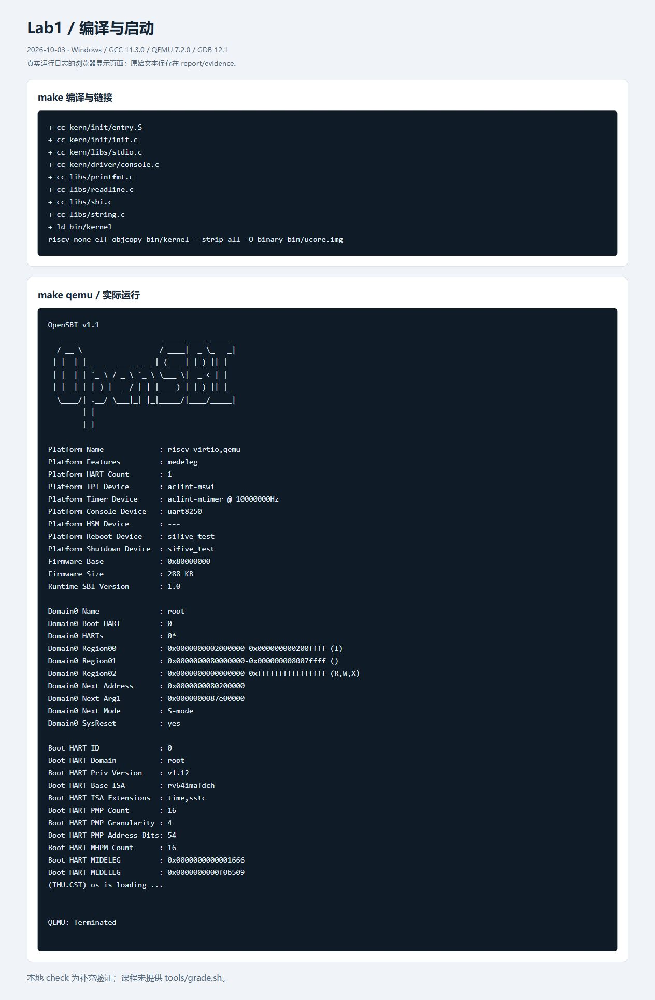

原始证据：[build.log](evidence/build.log)、[make-qemu.log](evidence/make-qemu.log)、[elf-layout.log](evidence/elf-layout.log)。

### B.2 复位、内核入口和栈

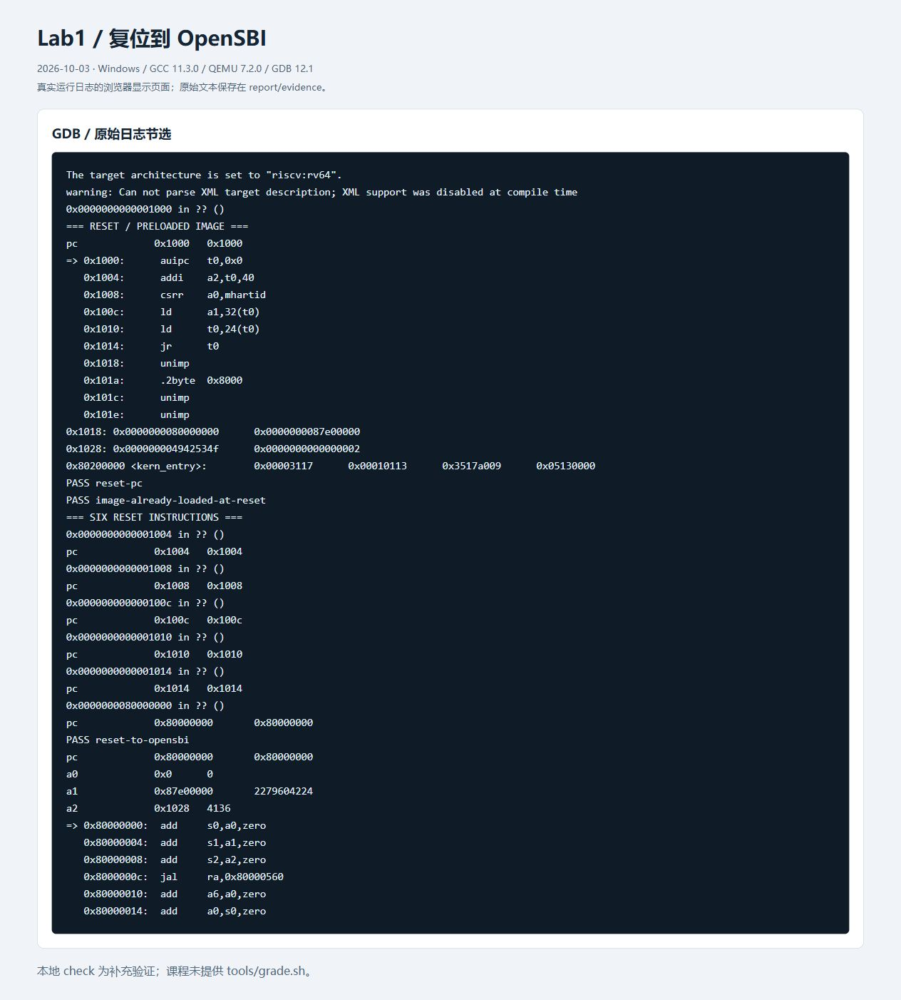

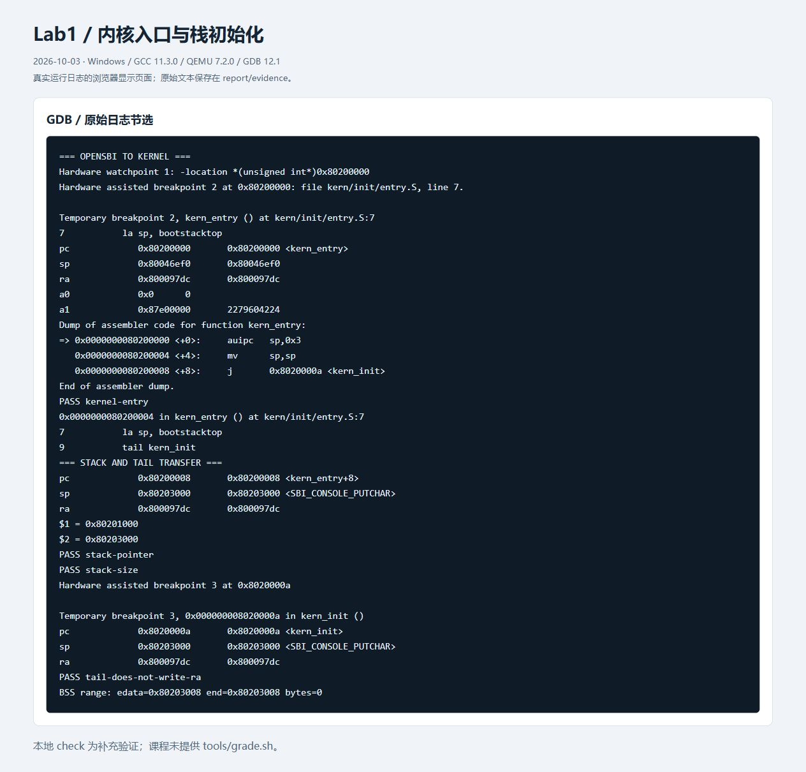

原始证据：[gdb.log](evidence/gdb.log)、[kernel-symbols.log](evidence/kernel-symbols.log)、[entry-disassembly.log](evidence/entry-disassembly.log)。

### B.3 本地自动检查和 SBI 证据

13 项检查包括：复位 PC；复位时镜像已存在；进入 OpenSBI；进入内核；栈顶地址；栈大小；尾跳转不写 RA；到达 `cprintf`；SBI 参数；进入固件异常入口；返回内核；启动字符串；S-mode ecall 原因 9。全部通过。

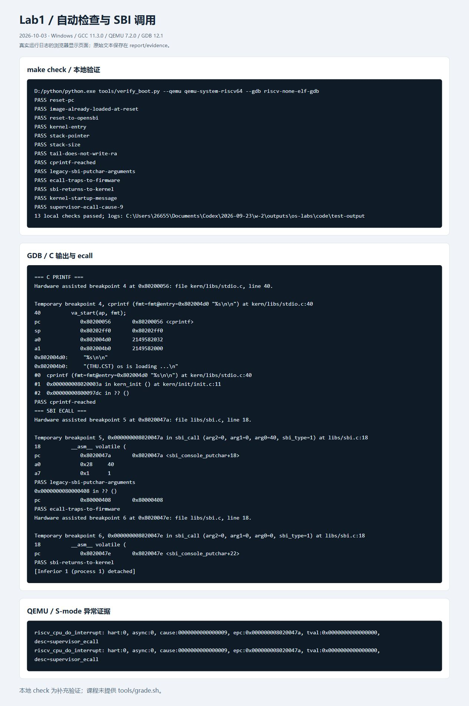

原始证据：[local-check.log](evidence/local-check.log)、[traps.log](evidence/traps.log)、[summary.json](evidence/summary.json)。本次镜像 SHA256：

```text
997228412f63ece956133e3582821b2c5af2014b758ef19fd8ad26c080d38664
```

### B.4 官方评分器缺失

实际执行 `make grade` 报错：

```text
sh: can't open 'tools/grade.sh': No such file or directory
make: *** [Makefile:203: grade] Error 2
```

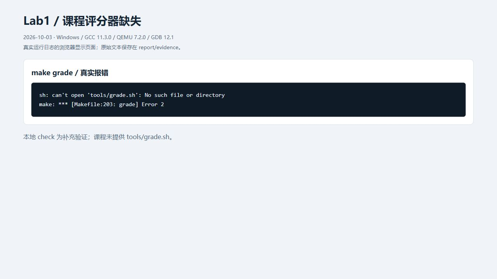

原始证据：[official-grade-unavailable.log](evidence/official-grade-unavailable.log)。收到的代码未提供评分脚本，所以不能宣称官方评分通过；上述 `make check` 是补充的本地验证。若教师随后提供原版评分器，需另行检查。

### B.5 按四段式执行的补齐复核

在补齐规格制定后，实际再次执行 `make grade`、构建、`make qemu` 和 `make check`。构建及运行成功，13 项本地检查通过，`make grade` 仍因脚本缺失返回 2。组长确认没有其他代码包或单独评分脚本。课程当前的 Lab1 文件树在 `tools` 下也只列出 `function.mk` 和 `kernel.ld`；这是收到新答疑之前的核对记录；根据答疑第3条，目前不再把该评分项作为 Lab1 待办，不借用其他实验或架构的评分脚本。

复核证据：[build.log](evidence/followup/build.log)、[qemu-run.log](evidence/followup/qemu-run.log)、[local-check.log](evidence/followup/local-check.log)、[gdb.log](evidence/followup/gdb.log)、[official-grade.log](evidence/followup/official-grade.log)、[execution.json](evidence/followup/execution.json)。`execution.json` 保存执行规格 SHA256，可与本次 [task-spec.md](evidence/followup/task-spec.md) 对照。


---

## 附录 C：此前QEMU6.2的真实截图（历史记录）

以下六张图均来自此前Ubuntu的QEMU6.2/OpenSBI0.9环境，原始字节和来源保持不变。它们不能替代指定QEMU4.1.1环境的新截图；相关寄存器值仅解释这次历史运行。

### 5.1 重新编译

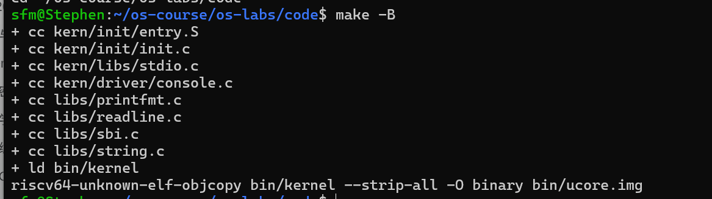

截图显示八个源文件的编译、`bin/kernel` 的链接及 `objcopy` 生成 `bin/ucore.img`。目标是 RV64 裸机内核，ELF 机器类型和入口见 [elf-layout.log](evidence/ubuntu/elf-layout.log)。独立保存的完整构建日志见 [build.log](evidence/ubuntu/run-20261004-191910/build.log)。

### 5.2 本地自动检查

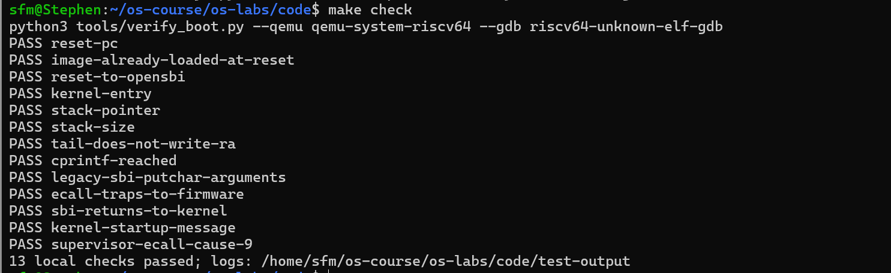

截图明确显示 `13 local checks passed`。检查覆盖复位 PC、复位时已装入的镜像、进入 OpenSBI、进入内核、栈顶、栈大小、尾跳转保持 RA、到达 `cprintf`、SBI 参数、进入固件陷阱入口、返回内核、启动字符串及 S-mode ecall 原因 9。

原始证据：[check.log](evidence/ubuntu/run-20261004-191910/check.log)、[summary.json](evidence/ubuntu/run-20261004-191910/boot/summary.json)、[traps.log](evidence/ubuntu/run-20261004-191910/boot/traps.log)。`make check` 是本次补充的本地验证，不是教师官方评分器。

### 5.3 QEMU 启动与内核输出

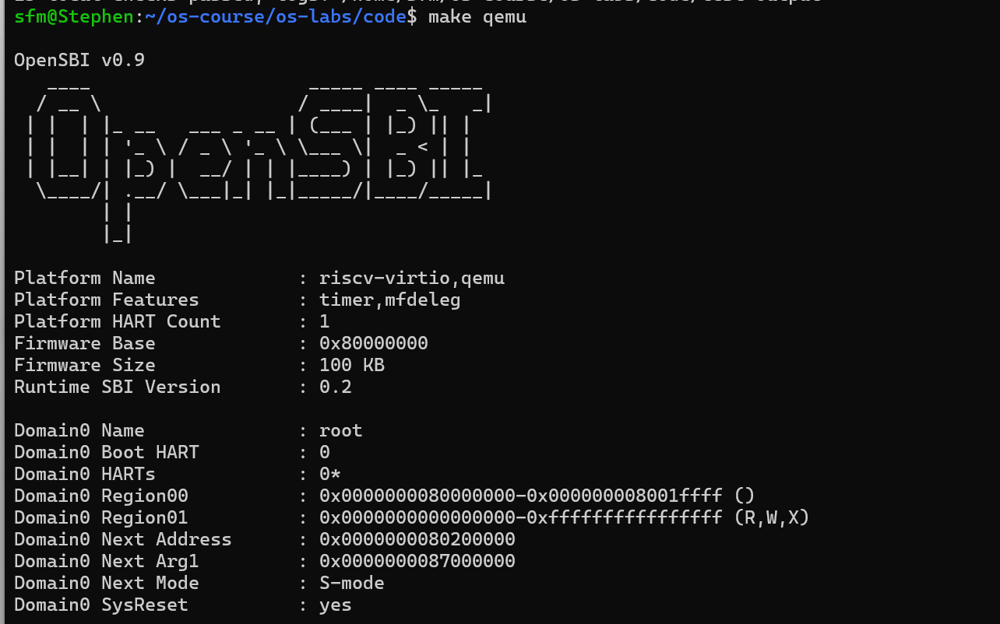

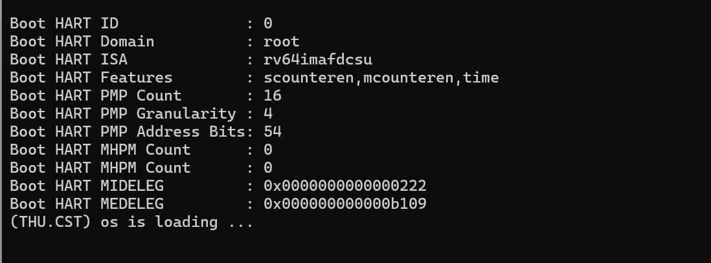

两图共同展示同一类启动过程：OpenSBI v0.9 的固件基址为 `0x80000000`，下一阶段地址为 `0x80200000`，下一阶段特权级为 S-mode；内核输出 `(THU.CST) os is loading ...`。之后框架停在无限循环，符合预期。独立完整日志见 [make-qemu.log](evidence/ubuntu/run-20261004-191910/make-qemu.log)。两张新截图本身未显示退出步骤；此前真实自动运行日志显示正常退出，退出码为 0，见 [execution.json](evidence/ubuntu/run-20261004-191910/execution.json)。

### 5.4 GDB 复位、内核入口与栈

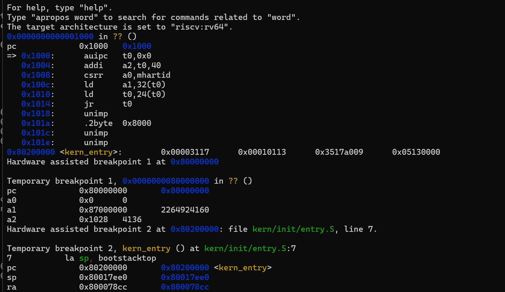

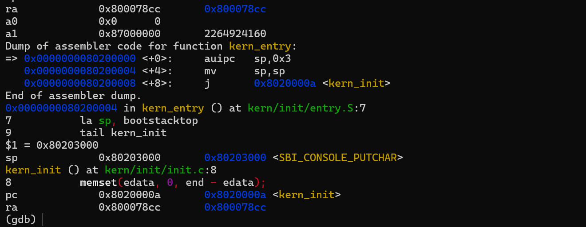

第五张图观察到初始 PC 为 `0x1000`，复位桩后进入固件 `0x80000000`，随后断点停在内核入口 `0x80200000`。进入内核时 SP 为 `0x80017ee0`，RA 为 `0x800078cc`。

第六张图显示入口反汇编为 `auipc sp,0x3`、`mv sp,sp` 和 `j kern_init`；执行建栈后 SP 为 `0x80203000`，随后 PC 为 `0x8020000a <kern_init>`，RA 仍为 `0x800078cc`。这与练习 1 对建栈和尾跳转的分析一致。独立完整 GDB 会话见 [gdb.log](evidence/ubuntu/boot/gdb.log)。

