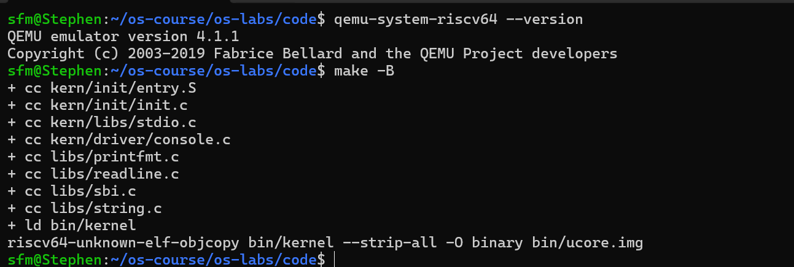
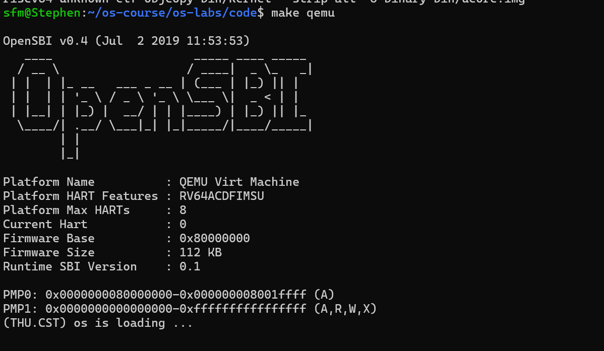
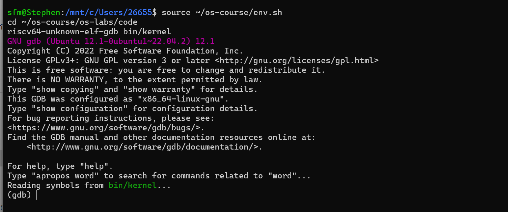
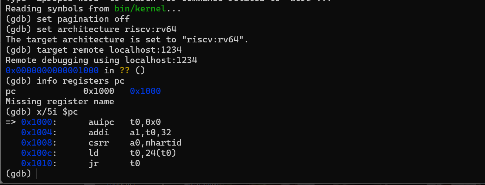
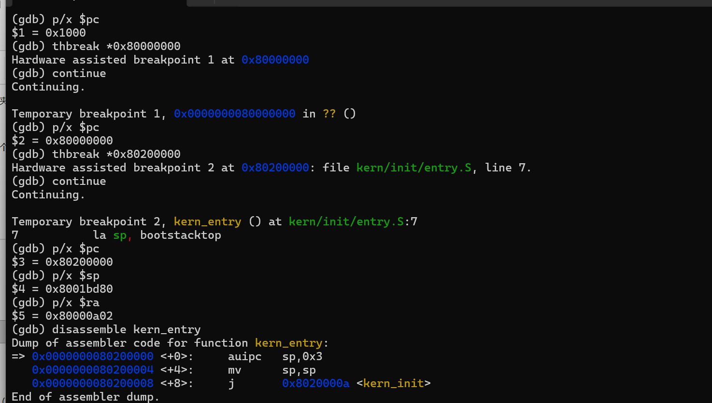
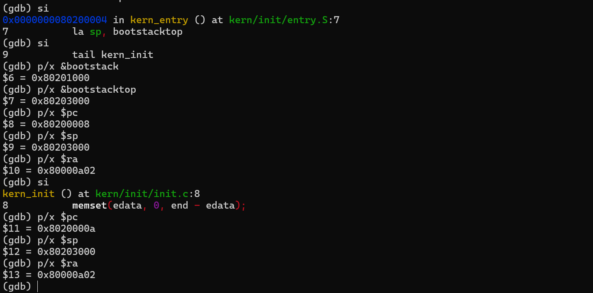

# 操作系统实验报告

## 实验基本信息

| 项目 | 内容 |
|------|------|
| **实验名称** | Lab1：最小可执行内核与启动流程 |
| **小组成员** | 2412396-申丰铭（组长）、2411688-马翔宇、2413992-任诗清 |
| **实验日期** | 2026-10-06 |

### 小组分工安排

| 成员 | 负责的练习/模块 |
|------|----------------|
| 2412396-申丰铭（组长） | 统筹实验；配置交叉编译与仿真环境；完成练习2；配置启动参数；整理调试与验证工具；管理实验分支和提交 |
| 2411688-马翔宇 | 负责练习1；分析入口汇编、链接脚本、内核栈与调用约定；整理 OS 原理对应关系 |
| 2413992-任诗清 | 整理测试日志和截图；协助复核练习2；检查报告格式与图片引用 |

报告分工：申丰铭负责整体逻辑、环境、调试过程及主稿整合；马翔宇负责入口汇编解释和知识点总结；任诗清负责证据整理和全文校对。

| 成员 | 当前实际进度 |
|------|--------------|
| 申丰铭（组长） | 已完成编译、启动与GDB调试 |
| 马翔宇 | 已完成练习1源码分析与入口汇编验证；完成内核入口、栈初始化及tail跳转分析；结合GDB复核入口寄存器变化，并整理启动流程相关OS原理 |
| 任诗清 | 已完成个人环境配置与实验运行；完成编译、QEMU启动及GDB手动复核，核对复位入口、OpenSBI入口、内核入口、内核栈初始化及tail跳转结果；完成测试日志、截图整理和报告校对 |

---

## 一、实验目的

1. 理解 RISC-V 从复位、执行固件到进入最小内核的过程，区分 QEMU、MROM、OpenSBI 与内核的职责。
2. 理解链接脚本如何确定内存布局与入口地址，掌握 C/汇编源文件经交叉编译生成 ELF 和裸镜像的流程。
3. 解释入口代码建立栈并移交 C 初始化函数的原因，理解 SBI 控制台输出调用链。
4. 用 QEMU/GDB 观察真实的 PC、SP、RA 变化，以调试证据验证源码分析和 AI 解释。

本实验通过源码分析、交叉编译、QEMU启动和GDB单步调试，理解最小内核的启动流程。

---

## 二、实验环境

本实验在WSL2的Ubuntu22.04.5 LTS中编译RV64裸机内核，并使用QEMU4.1.1运行。实验目录为 `~/os-course/os-labs/code`。生成ELF的机器类型为RISC-V，入口地址为 `0x80200000`，见[ELF布局日志](evidence/qemu-4.1.1/elf-layout.log)。

| 项目 | Ubuntu 实际配置 |
|------|-----------------|
| Linux 环境 | WSL2，Ubuntu 22.04.5 LTS，普通用户 `sfm` |
| 交叉编译器 | `riscv64-unknown-elf-gcc` 10.2.0，Ubuntu 官方包 |
| 编译目标 | `-march=rv64gc -mabi=lp64d -mcmodel=medany` |
| 调试器 | `gdb-multiarch` 12.1；提供 `riscv64-unknown-elf-gdb` 符号链接 |
| 构建及基础工具 | Make 4.3、Git 2.34.1、Python 3.10.12、nano 6.2 |
| 模拟器 | QEMU 4.1.1；`virt`、1 hart、128 MiB RAM |
| 实际运行固件 | `-bios default` 使用 QEMU 内置 OpenSBI v0.4 |
| 额外安装的固件包 | Ubuntu `opensbi` 1.3；本次启动没有指定该包中的镜像 |
| Node.js / npm | 官方 Node.js v22.23.3 / npm 10.9.9，下载后验证 SHA256 |

QEMU由[官方4.1.1源码](https://download.qemu.org/qemu-4.1.1.tar.xz)构建，安装目录为 `~/.local/share/os-course/qemu-4.1.1`。版本输出见[version.log](evidence/qemu-4.1.1/version.log)，运行命令与镜像哈希见[execution.json](evidence/qemu-4.1.1/execution.json)。

| 成员 | AI 编程工具 | 底层模型 | 备注 |
|------|------------|---------|------|
| 2412396-申丰铭 | Codex 桌面应用 | GPT-6（本次会话） | 组长提供资料，工具直接读取项目、构建和调试 |
| 2411688-马翔宇 | 组长共享AI会话 | GPT-6（共享会话） | 参与练习1分析、入口汇编解释、链接脚本分析及报告完善，由组长发起AI会话共同完成 |
| 2413992-任诗清 | Codex（VS Code） | GPT-5.5 | 用于环境配置、实验流程梳理、报错分析和GDB复核指导 |

---

## 三、实验整体逻辑分析

### 3.1 本章节的逻辑主线

本章解决的问题是：没有已有操作系统替我们分配栈、创建进程并调用 `main`，如何让最小内核开始执行并输出信息。

```text
QEMU 预先装入固件与内核镜像
 → CPU 复位，PC=0x1000，执行 MROM 复位桩
 → PC=0x80000000，进入 OpenSBI
 → OpenSBI 完成环境设置，以 S-mode 进入 0x80200000
 → kern_entry 设置内核栈，tail 跳入 kern_init
 → kern_init 初始化 BSS 范围并调用 cprintf
 → 格式化输出通过 SBI ecall 请求固件输出字符
 → 内核进入 while(1) 无限循环
```

需要区分镜像装入与控制权移交：本次 `-device loader,file=bin/ucore.img,addr=0x80200000` 模式下，CPU 尚停在 `0x1000` 时，GDB 已读到 `0x80200000` 上的内核指令。因此镜像由 QEMU 在执行前装入，OpenSBI 主要进行固件初始化、确定下一阶段地址与特权级，并移交控制权。

### 3.2 功能的逐步实现

1. **确定布局和入口。** `kernel.ld` 设置基址并组织 `.text`、`.rodata`、`.data` 等段；先确定布局，代码的地址引用才能与装载位置相符。
2. **编译与生成镜像。** `.c`、`.S` 编译为 RV64 目标文件，链接生成含调试信息的 `bin/kernel`，再由 `objcopy -O binary` 生成 `bin/ucore.img`。
3. **建立 C 运行环境。** `entry.S` 设置 SP 后跳到 `kern_init`；先有栈，C 函数才能安全保存寄存器和调用其他函数。
4. **实现可见输出。** 调用链为 `kern_init → cprintf → vcprintf → vprintfmt → cputch → cons_putc → sbi_console_putchar → ecall`。内核负责格式化，OpenSBI 负责控制台服务。
5. **逐段验证。** 用单步观察复位桩，在固件和内核入口设断点，检查栈、尾跳转和 SBI 调用，使结论能对应源码、机器指令和运行日志。

---

## 四、实验内容与实现

本节分别分析内核入口操作，并使用GDB观察从复位、执行固件到进入内核的过程。

### 练习1：理解内核启动中的程序入口操作

**分工安排：** 2411688-马翔宇。完成入口汇编分析、内核栈初始化验证、tail跳转机制分析，并结合GDB验证入口执行过程。

```asm
kern_entry:
    la sp, bootstacktop
    tail kern_init
```

**`la sp, bootstacktop` 的操作与目的。** `la` 是取得地址的伪指令，将符号 `bootstacktop` 的地址写入 SP，不是读取该地址上存放的值。`bootstack` 通过 `.space KSTACKSIZE` 预留 8192 字节，栈从高地址向低地址增长，因此 SP 初始化为区域上界。

实测 `bootstack=0x80201000`、`bootstacktop=0x80203000`，相差 `0x2000` 即 8192 字节。内核刚开始执行时 SP 仍为固件栈地址 `0x8001bd80`；执行 `la` 后为 `0x80203000`。这建立内核自己的栈，使 C 函数能够保存寄存器、使用局部变量和调用函数，地址也满足栈对齐要求。

本次反汇编为：

```asm
0x80200000: auipc sp,0x3
0x80200004: mv    sp,sp
0x80200008: j     0x8020000a <kern_init>
```

`la` 展开为 PC 相对地址构造。这里低位偏移恰为 0，`addi sp,sp,0` 被显示为 `mv sp,sp`。机器指令受工具链和链接松弛影响，应检查当前镜像，而不能只凭伪指令名称推断。

**`tail kern_init` 的操作与目的。** `tail` 把控制权交给 `kern_init`，不为本次跳转写入新返回地址。入口汇编已经完成建栈，而 `kern_init` 为 `noreturn` 并最终无限循环，因此无需返回入口代码。

本次它被链接松弛为两字节的 `j`。执行前后 RA 都为 `0x80000a02`，PC 从 `0x80200008` 变为 `0x8020000a`，验证其没有改写 RA。`tail` 不负责初始化栈，其行为与普通 `call` 不同。

### 练习2：使用 GDB 验证启动流程

**负责人：** 2412396-申丰铭；任诗清协助复核证据。

#### 调试过程

在终端1运行 `make debug`，在终端2运行 `riscv64-unknown-elf-gdb bin/kernel`。QEMU的 `-S` 选项使CPU在执行第一条指令前暂停，`-s` 选项开放1234调试端口。GDB加载ELF符号并连接QEMU后，依次观察复位桩、固件入口、内核入口及栈初始化：

```gdb
set pagination off
set architecture riscv:rv64
target remote localhost:1234
p/x $pc
x/5i $pc
thbreak *0x80000000
continue
p/x $pc
thbreak *0x80200000
continue
p/x $pc
p/x $sp
p/x $ra
disassemble kern_entry
si
si
p/x &bootstack
p/x &bootstacktop
p/x $sp
p/x $ra
si
p/x $pc
p/x $sp
p/x $ra
```

自动调试的完整输出见[GDB日志](evidence/qemu-4.1.1/boot/gdb.log)，命令记录见[boot-session.gdb](evidence/qemu-4.1.1/boot/boot-session.gdb)。

#### 最初执行的指令位于什么地址，完成什么功能？

GDB连接后PC为 `0x1000`。当前QEMU4.1.1的复位桩有五条指令，尚未执行位于 `0x80000000` 的OpenSBI：

| 地址 | 指令 | 功能 |
|------|------|------|
| `0x1000` | `auipc t0,0x0` | 取得复位桩地址，作为后续地址计算的基准 |
| `0x1004` | `addi a1,t0,32` | a1指向MROM内的设备树，当前为 `0x1020` |
| `0x1008` | `csrr a0,mhartid` | 读取hart编号作为参数，当前为0 |
| `0x100c` | `ld t0,24(t0)` | 读取下一阶段固件地址 `0x80000000` |
| `0x1010` | `jr t0` | 跳入OpenSBI，移交控制权 |

实际单步序列为 `0x1004 → 0x1008 → 0x100c → 0x1010 → 0x80000000`。进入固件时 `a0=0`、`a1=0x1020`、`a2=0`；进入内核时a1为 `0x82200000`。复位地址取决于平台实现，不能推广为所有RISC-V处理器的固定地址。

#### 固件到内核第一条指令

观察固件入口后，设置 `thbreak *0x80200000` 并继续。断点停在 `entry.S` 的第一条指令，测得：

```text
pc=0x80200000 <kern_entry>
sp=0x8001bd80，ra=0x80000a02
a0=0，a1=0x82200000
```

内核入口断点位于 `0x80200000`。后续ecall陷阱入口的 `mcause=9` 确认内核从S-mode请求固件服务。

也按练习提示设置了 `watch -l *(unsigned int*)0x80200000`。监视点没有触发，直接到达内核断点；在初始 `PC=0x1000` 时内存首字已为 `0x00003117`，与当前镜像一致。因此本次内核由 QEMU 执行前装入，不能据此报告“OpenSBI 加载瞬间”。

#### C 初始化和 SBI 输出

`kern_init` 调用 `memset(edata,0,end-edata)` 清理 BSS 范围，再调用 `cprintf`。本次 `--gc-sections` 去掉未引用内容，最终 `edata=end=0x80203008`，BSS 范围长度为 0。因此本次没有验证非空 BSS 的逐字节清零；代码仍保留一般内核启动所需的初始化语义。

在 `cprintf` 入口，`a0`指向 `"%s\n\n"`，`a1`指向 `"(THU.CST) os is loading ...\n"`。首字符ecall前 `a7=1` 是旧版SBI控制台调用号，`a0=0x28` 为字符 `(`。通过QEMU monitor读取 `mtvec=0x80000470`，在该地址设置断点后观察到CPU进入固件陷阱处理入口。

在M态固件入口处，GDB读到 `mcause=9`、`mepc=0x80200492`，处理后返回内核 `0x80200496`。证据见 [GDB日志](evidence/qemu-4.1.1/boot/gdb.log)。S-mode环境调用的异常原因由陷阱入口处的架构CSR值确认。

它证明内核通过 S-mode 环境调用请求固件服务。最后串口输出 `(THU.CST) os is loading ...`，内核进入无限循环。停止输出符合框架预期，此时尚无 shell 或调度器。

#### 拓展：现代笔记本启动流程

普通 x86 笔记本通常由 CPU 复位进入主板固件，UEFI 初始化必要硬件并选择启动项，再执行引导程序，最后装入系统内核并移交控制权。它与实验共同体现分阶段引导思想，但复位地址、固件接口、介质和内核格式不同。实验由 QEMU 直接装入镜像，未实现从真实磁盘查找、读取和校验内核的完整流程。

---

## 五、测试与验证

以下为编译、内核启动与GDB调试结果。

### 5.1 编译与版本



编译输出包含八个源文件的编译、内核链接及objcopy生成bin/ucore.img，命令正常返回。

实测 `QEMU emulator version 4.1.1`。`make -B`完成编译、链接和镜像转换，ELF为RISC-V，入口 `0x80200000`。证据：[version.log](evidence/qemu-4.1.1/version.log)、[build.log](evidence/qemu-4.1.1/build.log)、[elf-layout.log](evidence/qemu-4.1.1/elf-layout.log)。

### 5.2 内核启动与输出



执行make qemu后，终端显示OpenSBI v0.4和内核启动信息。

Makefile使用 `-device loader,file=bin/ucore.img,addr=0x80200000`。实际 `make qemu`输出OpenSBI v0.4和 `(THU.CST) os is loading ...`，然后内核无限循环。按Ctrl+A、松开、X可退出模拟器；自动运行记录中的退出码为0。证据：[make-qemu.log](evidence/qemu-4.1.1/make-qemu.log)、[original-loader.log](evidence/qemu-4.1.1/original-loader.log)、[execution.json](evidence/qemu-4.1.1/execution.json)。

### 5.3 GDB与额外本地检查

#### 5.3.1 初始化与复位



辅助图显示GDB12.1启动并读取bin/kernel符号。随后将目标架构设为riscv:rv64，连接QEMU的localhost:1234。



初始PC为0x1000，反汇编显示五条复位指令。info registers pc输出提示Missing register name；使用p/x $pc可读取PC值，并观察到后续固件和内核入口地址。

#### 5.3.2 固件与内核入口



实际依次停在OpenSBI入口0x80000000和内核入口0x80200000。内核入口SP=0x8001bd80、RA=0x80000a02；kern_entry反汇编显示auipc sp,0x3、mv sp,sp和j kern_init。

#### 5.3.3 建栈与tail跳转



前两次单步后PC=0x80200008，栈底0x80201000、栈顶0x80203000，SP已设为栈顶。执行tail对应的跳转后，PC=0x8020000a并进入kern_init，SP仍为0x80203000，RA仍为0x80000a02。这直接验证入口建栈与tail不改写RA的分析。

#### 5.3.4 额外本地检查

13项本地自动检查全部通过。自动调试日志在固件陷阱入口0x80000470记录了mcause=9、mepc=0x80200492，并观察到返回内核0x80200496。

证据：[check.log](evidence/qemu-4.1.1/check.log)、[gdb.log](evidence/qemu-4.1.1/boot/gdb.log)、[summary.json](evidence/qemu-4.1.1/boot/summary.json)。

### 5.4 验证范围

内核镜像的SHA256为：

```text
a21c11243b36836e7c42ffa13b0539a1cd2ee712386bd0b4cd60468b1c3467fd
```

栈底 `0x80201000`、栈顶 `0x80203000`，大小8192字节。当前BSS的 `edata=end=0x80203008`，没有非空BSS逐字节清零的测试。

截图文件及对应校验值见[截图清单](evidence/qemu-4.1.1/user-terminal-screenshots.json)。

### 5.5 组员实验复核

任诗清在个人 WSL2 环境中使用 QEMU 4.1.1 和 GDB 对上述启动过程进行了复核。实测 CPU 初始 PC 为 0x1000，随后进入 OpenSBI 的 0x80000000，最终到达 kern_entry 的 0x80200000。执行入口建栈指令后，SP 设置为 0x80203000，与 bootstack=0x80201000 相差 0x2000，即 8192 字节。执行 tail kern_init 后进入 kern_init，RA 保持不变。个人实测结果与小组分析一致。

---

## 六、实验总结与收获

### 对操作系统的理解

| 实验知识点 | 对应 OS 原理 | 含义、关系与差异 |
|------------|-------------|----------------|
| 分阶段引导 | 系统启动 | 先准备环境再移交控制权；本实验直接装入镜像，未完整覆盖磁盘引导 |
| 链接地址、装载地址 | 程序装载和地址空间 | 布局应与实际物理位置匹配；这里尚无进程虚拟地址空间 |
| 内核栈与 SP | 函数调用和执行上下文 | 栈存放调用信息与局部数据；未涉及各进程独立栈与切换 |
| OpenSBI 与 ecall | 特权级和异常 | S-mode 内核请求 M-mode 固件服务；不同于 U-mode 用户请求 S-mode 内核的系统调用 |
| BSS 初始化 | C 运行环境 | 零初始化数据一般需运行前清零；本次实际范围为空，验证有相应边界 |
| 格式化与串口输出 | I/O 抽象 | 上层格式化、下层输出字符；本实验依赖固件服务，未建立完整驱动系统 |
| 断点、单步、反汇编 | 系统调试 | 源码体现意图，指令与寄存器体现执行；伪指令展开受工具链影响 |

`ENTRY(kern_entry)` 声明 ELF 入口，不能单独保证裸镜像首字节属于哪个段，因此还要核对段布局和反汇编。本次两者均对应 `0x80200000`。`ALIGN(0x1000)` 是向上对齐到 4096 字节边界，不是对齐到 `2^0x1000`。

裸二进制没有 ELF 那样的入口头，其入口依赖启动参数和布局约定。`.bss` 的 NOBITS 数据通常不直接占据输出文件字节；镜像是否包含零填充取决于实际可加载段。本次 8 KiB 栈位于 `.data`，体现在镜像中，实际 BSS 范围为空。

本实验未覆盖的重要 OS 原理包括：物理页分配与回收、多级页表、虚拟内存、进程/线程管理、抢占调度、中断框架、同步互斥、用户态系统调用、文件系统与持久存储。能启动并打印信息的最小内核，还没有这些完整系统功能。

### 实验方法与心得

源码描述程序意图，反汇编展示实际指令，寄存器与断点揭示执行状态。结合三者能够验证入口地址、栈初始化与tail跳转的行为，也能避免仅凭伪指令名称推断机器指令。

本实验体现了分阶段启动与特权级划分：QEMU装入镜像，复位桩进入固件，OpenSBI准备环境并向内核移交控制权，内核再通过SBI调用获取控制台服务。启动信息的输出依赖这些阶段的正确衔接。

任诗清：通过本次个人复核，我对 RISC-V 内核启动过程有了更直观的认识。最初我只知道 uCore 会从内核入口开始运行，而在 GDB 中依次观察到 PC 从 0x1000 进入 0x80000000，再到 0x80200000 后，我才真正区分了 QEMU 复位桩、OpenSBI 固件和 uCore 内核三个阶段。通过单步观察 SP 和 RA 的变化，也进一步理解了入口代码建立内核栈以及 tail kern_init 不保存新返回地址的原因。相比只阅读源码，实际调试使启动流程和寄存器变化之间的对应关系更加清晰。

### 参考资料

1. [课程Lab1练习](http://8.135.34.58/lab2026/_book/lab1/lab1_2_1_exercise.html)。
2. [课程报告要求](http://8.135.34.58/lab2026/_book/lab1/lab1_5_requirement.html)。
3. 实验报告模板、环境说明与Lab1源码。
4. [QEMU官方源码](https://download.qemu.org/qemu-4.1.1.tar.xz)。
5. [课程Linux环境说明](http://8.135.34.58/lab2026/_book/lab0/0_Linux.html)、[工具配置说明](http://8.135.34.58/lab2026/_book/lab0/3_startdash.html)、[Lab1文件组成](http://8.135.34.58/lab2026/_book/lab1/lab1_2_2_file.html)。
